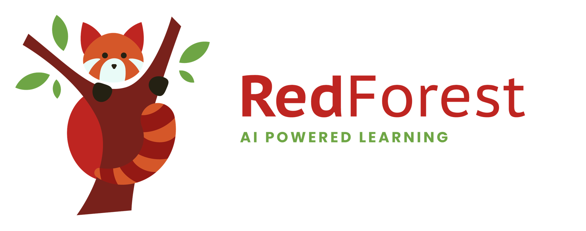

#

The web and mobile application for the OpenLMS ecosystem.

# TODO
- [x] - Add state management (zustand)
- [x] - Access token for user, 
- [x]  - Obtain their general information
- [x] - Add state persistance
- [] - Test in android/ios
- [] - Make proper login and after-login user account profile